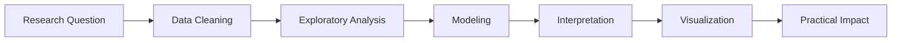

# Hi there, I’m Ruiping 👋

```python
ruiping = {
    "role": "Ph.D. Candidate in Educational Psychology",
    "location": "Chicago, IL",
    "interests": [
        "AI in Education",
        "Data Science",
        "Learning Analytics",
        "Psychometrics",
        "Educational Measurement"
    ],
    "current_status": "Turning research questions into data-driven insights"
}
```

## 📊 Recent Activity Report

```text
Observation period: 2025–2026
Primary environment: Python, R, SQL, SPSS, and too many browser tabs
Current mood: Model fitted successfully ✅
```

### 🤖 Teachers’ AI Adoption and Classroom Use

Recently, I analyzed the **OECD TALIS 2024 teacher survey**, including:

- **278,383 teachers**
- **55 countries and regions**
- **630 variables**
- A healthy amount of data cleaning

My project examines two related questions:

1. Which factors predict whether teachers adopt AI?
2. Among teachers who use AI, who uses it directly with students?

```python
research_framework = {
    "stage_1": "AI adoption",
    "stage_2": "Student-facing AI use",
    "key_idea": "Adoption first, then pedagogical integration"
}
```

Some of my recent work includes:

- Exploratory data analysis across countries and school levels
- Logistic regression with country fixed effects
- School-clustered standard errors
- Feature distribution and train–test balance checks
- Robustness and sensitivity analyses
- Data visualization for technical and nontechnical audiences

### 📚 AI in K–12 Education Research

I also completed an umbrella review of **102 systematic reviews** examining artificial intelligence in K–12 education.

```r
included_reviews <- 102
publication_status <- "Accepted"
coffee_consumed <- "Not reliably measured"
```

This work maps the existing evidence, identifies research gaps, and explores how AI may influence teaching, learning, assessment, and educational equity.

### 🧑‍🏫 Generative AI Literacy for Teachers

I am currently studying how teachers develop the knowledge and confidence needed to use generative AI for classroom assessment.

My work includes:

- Designing professional development workshops
- Developing and validating survey measures
- Conducting teacher interviews
- Examining confidence, frequency of use, ethics, and instructional decision-making
- Translating research findings into practical classroom guidance

## 🧰 Analytical Toolkit

```sql
SELECT skill
FROM ruiping_toolkit
WHERE category IN (
    'Programming',
    'Statistics',
    'Machine Learning',
    'Psychometrics',
    'Visualization'
);
```

**Programming and data:** Python, R, SQL, SAS, Stata, SPSS, MATLAB  
**Modeling:** Regression, multilevel modeling, SEM, factor analysis, IRT, random forest, XGBoost, clustering  
**Visualization:** Tableau, Power BI, Streamlit, Matplotlib, ggplot2  
**Research tools:** Qualtrics, Mplus, HLM, AMOS, Winsteps, IRTPro, ConQuest  
**Workflow:** Data cleaning, validation, ETL, reproducible analysis, model interpretation

## 🔍 Current Research Pipeline



## 🌱 What I’m Learning

- Building AI agents and multi-agent workflows
- Using LLM APIs and function calling
- Designing responsible AI applications
- Making complex analyses easier to understand
- Creating research that is both rigorous and useful

## 🎯 My Working Hypothesis

> Good analysis does more than produce statistically significant results—it helps people make better decisions.

## 📈 Model Diagnostics

```text
Curiosity:          ██████████ 100%
Research questions: █████████░  90%
Data cleaning:      ████████░░  80%
Coffee level:       █████████░  90%
Free time:          ██░░░░░░░░  20%
```

## 🤝 Let’s Connect

I enjoy collaborating on projects related to:

- AI in education
- Educational and behavioral data science
- Learning analytics
- Psychometrics and measurement
- Responsible and human-centered AI
- Data storytelling and visualization

```python
while curiosity:
    ask_questions()
    analyze_data()
    communicate_findings()
```

[](https://tokscale.ai/u/ruiping935)
